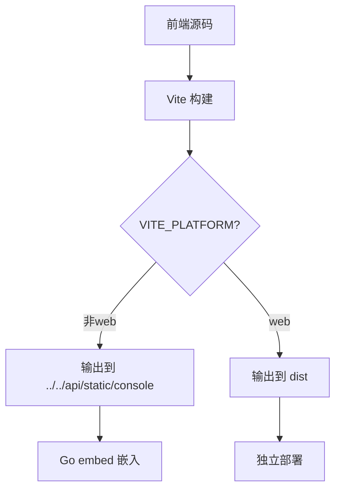

# 53AIHub 部署指南

## 项目概述

53AIHub 是一个基于 Go 后端 + Vue 前端的 AI 平台项目，包含管理后台和用户前端两个独立的前端应用。项目采用 Go embed 技术将前端静态文件嵌入到后端二进制文件中，实现单一二进制文件部署。

## 项目架构

```
53AIHub/
├── api/                    # Go 后端服务
│   ├── main.go            # 入口文件，使用 embed 嵌入静态文件
│   ├── Dockerfile         # Docker 构建文件
│   ├── static/            # 前端构建产物目录（运行时嵌入）
│   │   ├── console/       # 管理后台构建产物
│   │   ├── front/         # 用户前端构建产物
│   │   ├── images/        # 静态图片资源
│   │   └── libs/          # 静态库文件
│   └── ...                # 其他 Go 源码文件
├── web/                   # 前端项目目录
│   ├── console/           # 管理后台前端项目（Vue + Vite）
│   └── front/             # 用户前端项目（Vue + Vite + Electron）
└── docker/                # Docker Compose 配置
```

## 快速部署步骤

### 1. 环境准备

```bash
# 确保安装以下环境
- Node.js 18+
- Go 1.24+
- Docker（可选）
```

### 2. 构建前端项目

```bash
# 构建管理后台
cd web/console
npm install
npm run build

# 构建用户前端
cd ../front
npm install
npm run build
```

### 3. 构建 Go 后端

```bash
cd api

# 方法一：使用 Makefile 构建（Linux/Mac）
make static-build

# 方法二：直接使用 go build（Linux/Mac）
CGO_ENABLED=0 go build -trimpath -o bin/53aihub -a -ldflags '-X "github.com/53AI/53AIHub/config.VersionTime=$(date +%Y%m%d%H%M%S)" -extldflags "-static"' ./main.go

# 方法三：Windows 环境构建
set CGO_ENABLED=0
go build -v -o bin/53aihub.exe ./main.go
```

**注意事项：**
- 如果遇到 `go-sqlite3` CGO 编译错误，请使用 `CGO_ENABLED=0` 禁用 CGO
- Windows 环境建议使用方法三
- 构建成功后，二进制文件大小约为 130MB（包含嵌入的前端静态文件）

### 4. Docker 部署（推荐）

#### 4.1 使用官方镜像（简单快速）

```bash
# 使用官方预构建镜像部署
cd docker
docker-compose up -d
```

#### 4.2 使用自己编译的镜像

**方法一：从 Docker Hub 拉取自定义镜像**

```bash
# 拉取自定义镜像
docker pull joeyzenghuan123/53ai-hub:latest

# 修改 docker-compose.yml 文件中的镜像名称
# 将 image: joeyzenghuan123/53ai-hub:latest 
# 改为 image: joeyzenghuan123/53ai-hub:latest

cd docker
docker-compose up -d
```

**方法二：本地构建镜像**

```bash
# 确保已构建前端项目（参见步骤2）
# 本地构建 Docker 镜像
docker build -t joeyzenghuan123/53ai-hub:latest -f api/Dockerfile .

# 推送到 Docker Hub（可选）
docker push joeyzenghuan123/53ai-hub:latest

# 使用本地构建的镜像运行
docker run -d \
  --name 53aihub \
  -p 3000:3000 \
  -e REDIS_HOST=redis \
  -e MYSQL_HOST=mysql \
  joeyzenghuan123/53ai-hub:latest
```

**方法三：完整的多阶段构建（包含前端构建）**

```bash
# 使用改进的 Dockerfile 进行完整构建
# 注意：这需要使用文档后面提到的改进版 Dockerfile
docker build -t joeyzenghuan123/53ai-hub:complete -f Dockerfile.complete .
```

### 5. 直接运行

```bash
cd api
./bin/53aihub
```

## 详细部署原理

### 一、前端构建配置原理

#### 1.1 Console 项目构建配置

**位置：** `web/console/vite.config.ts`

**关键配置：**

```typescript
build: {
  outDir: viteEnv.VITE_PLATFORM === 'web' ? 'dist' : `../../api/static/console`,
  assetsDir: 'static/images/',
  rollupOptions: {
    output: {
      chunkFileNames: 'static/js/[name]-[hash].js',
      entryFileNames: 'static/js/[name]-[hash].js',
      assetFileNames: 'static/[ext]/[name]-[hash].[ext]',
    }
  }
}
```

**原理说明：**

1. **智能输出路径：** 根据 `VITE_PLATFORM` 环境变量动态设置输出目录
   - 当 `VITE_PLATFORM !== 'web'` 时，输出到 `../../api/static/console`
   - 这样构建产物直接输出到 Go 应用可以嵌入的位置

2. **资源文件组织：** 
   - `assetsDir: 'static/images/'` 将图片等静态资源放到 `static/images/` 子目录
   - 通过 `rollupOptions.output` 配置 JS、CSS 文件的输出路径和命名规则

3. **文件哈希：** 使用 `[name]-[hash]` 模式确保缓存更新

#### 1.2 Front 项目构建配置

**位置：** `web/front/vite.config.ts`

**关键配置：**

```typescript
build: {
  ...commonBuild,
  outDir: resolve('../../api/static/front')
}
```

**原理说明：**

1. **直接路径映射：** 使用 `resolve('../../api/static/front')` 直接指定输出目录
2. **公共配置复用：** 通过 `vite.common.ts` 复用配置，避免重复
3. **版本管理：** 内置 `versionPlugin` 自动生成版本文件

### 二、Go Embed 静态文件嵌入原理

#### 2.1 Embed 指令配置

**位置：** `api/main.go`

```go
//go:embed all:static/front all:static/console static/images all:static/libs
var buildFS embed.FS
```

**原理说明：**

1. **编译时嵌入：** Go 1.16+ 的 `embed` 功能在编译时将静态文件嵌入到二进制文件中
2. **目录嵌入：** `all:` 前缀表示递归包含目录下的所有文件，包括隐藏文件
3. **内存文件系统：** 嵌入的文件形成虚拟文件系统，可通过 `fs.FS` 接口访问

#### 2.2 静态文件路由配置

**位置：** `api/router/static.go`

**关键功能：**

```go
func SetStaticRouter(router *gin.Engine, buildFS embed.FS) error {
    // 创建子文件系统
    rendererSubFS, _ := fs.Sub(buildFS, "static/front")
    distSubFS, _ := fs.Sub(buildFS, "static/console")
    
    // 注册静态文件路由
    router.StaticFS("/static/front", http.FS(rendererSubFS))
    router.StaticFS("/static/console", http.FS(distSubFS))
    
    // SPA 路由处理
    router.NoRoute(func(c *gin.Context) {
        // 处理前端路由，返回相应的 index.html
    })
}
```

**原理说明：**

1. **子文件系统：** 使用 `fs.Sub` 创建子文件系统，隔离不同前端应用的文件
2. **路由映射：** 
   - `/` 和前端路由 → `static/front/index.html`
   - `/console` 和后台路由 → `static/console/index.html`
3. **SPA 支持：** `NoRoute` 处理器确保前端路由正常工作，避免 404 错误

### 三、构建流程原理

#### 3.1 前端构建流程



#### 3.2 Go 构建流程

**Makefile 构建：**

```makefile
static-build: swagger-init
	CGO_ENABLED=0 $(GOBUILD) -trimpath $(BUILD_FLAGS) -o $(BIN_DIR)/$(BINARY_NAME) -a -ldflags '-X "github.com/53AI/53AIHub/config.VersionTime=$(shell date +%Y%m%d%H%M%S)" -extldflags "-static"' ./main.go
```

**构建参数说明：**

- `CGO_ENABLED=0`: 禁用 CGO，生成纯静态二进制
- `-trimpath`: 去除编译路径信息，减小二进制大小
- `-a`: 强制重新构建所有包
- `-ldflags`: 链接标志
  - `-X`: 设置版本时间变量
  - `-extldflags "-static"`: 静态链接

### 四、Docker 部署原理

#### 4.1 当前 Dockerfile 分析

**位置：** `api/Dockerfile`

**问题：** 当前 Dockerfile 只构建 Go 应用，**没有包含前端构建步骤**

```dockerfile
FROM golang:1.24.1 as builder
WORKDIR /app
ENV GOPROXY=https://goproxy.cn,direct
COPY go.mod go.sum ./
RUN go mod download
COPY . .
RUN CGO_ENABLED=0 GOOS=linux go build -a -installsuffix cgo -o /app/53AIHub -ldflags '-X "github.com/53AI/53AIHub/config.VersionTime=$(date +%Y%m%d%H%M%S)" -w -s' ./main.go

FROM alpine:3.18
RUN apk --no-cache add ca-certificates tzdata
RUN addgroup -g 1001 -S appgroup && adduser -u 1001 -S appuser -G appgroup
COPY --from=builder /app/53AIHub /app/53AIHub
RUN chown -R appuser:appgroup /app
USER appuser
WORKDIR /app
EXPOSE 3000
CMD ["./53AIHub"]
```

#### 4.2 改进的多阶段构建 Dockerfile

**完整的前后端构建方案：**

```dockerfile
# 第一阶段：构建前端
FROM node:18-alpine as frontend-builder

# 设置工作目录
WORKDIR /app

# 构建 Console 项目
COPY web/console/package*.json ./console/
RUN cd console && npm ci --only=production

COPY web/console ./console/
RUN cd console && npm run build

# 构建 Front 项目  
COPY web/front/package*.json ./front/
RUN cd front && npm ci --only=production

COPY web/front ./front/
RUN cd front && npm run build

# 第二阶段：构建 Go 应用
FROM golang:1.24.1 as backend-builder

WORKDIR /app

# 设置 Go 代理
ENV GOPROXY=https://goproxy.cn,direct

# 复制前端构建产物到正确位置
COPY --from=frontend-builder /app/console/../../api/static/console ./api/static/console
COPY --from=frontend-builder /app/front/../../api/static/front ./api/static/front

# 复制其他静态资源
COPY api/static/images ./api/static/images
COPY api/static/libs ./api/static/libs

# 构建 Go 应用
COPY api/go.mod api/go.sum ./api/
WORKDIR /app/api
RUN go mod download

COPY api/ ./
RUN CGO_ENABLED=0 GOOS=linux go build -a -installsuffix cgo -o /app/53AIHub \
    -ldflags '-X "github.com/53AI/53AIHub/config.VersionTime=$(date +%Y%m%d%H%M%S)" -w -s' ./main.go

# 第三阶段：运行时镜像
FROM alpine:3.18

# 安装运行时依赖
RUN apk --no-cache add ca-certificates tzdata

# 创建非 root 用户
RUN addgroup -g 1001 -S appgroup && \
    adduser -u 1001 -S appuser -G appgroup

# 复制二进制文件
COPY --from=backend-builder /app/53AIHub /app/53AIHub

# 设置权限
RUN chown -R appuser:appgroup /app

# 切换用户
USER appuser

# 设置工作目录和端口
WORKDIR /app
EXPOSE 3000

# 启动命令
CMD ["./53AIHub"]
```

#### 4.3 自定义镜像构建与发布流程

**构建并发布到 Docker Hub 的完整流程：**

```bash
# 1. 准备工作：确保前端已构建
cd web/console && npm install && npm run build
cd ../front && npm install && npm run build
cd ../../

# 2. 使用当前 Dockerfile 构建（仅后端）
docker build -t joeyzenghuan123/53ai-hub:latest -f api/Dockerfile .

# 3. 或使用完整构建 Dockerfile（包含前端构建）
# 首先创建 Dockerfile.complete 文件，内容为上面的改进版多阶段构建
docker build -t joeyzenghuan123/53ai-hub:complete -f Dockerfile.complete .

# 4. 测试镜像
docker run -d --name test-53aihub -p 3000:3000 joeyzenghuan123/53ai-hub:latest

# 5. 推送到 Docker Hub
docker login
docker push joeyzenghuan123/53ai-hub:latest
docker push joeyzenghuan123/53ai-hub:complete

# 6. 清理测试容器
docker stop test-53aihub && docker rm test-53aihub
```

**更新 docker-compose.yml 使用自定义镜像：**

```yaml
version: '3.8'

services:
  web:
    image: joeyzenghuan123/53ai-hub:latest  # 使用自定义镜像
    env_file: .env
    ports:
      - "3000:3000"
    environment:
      - REDIS_HOST=redis
      - MYSQL_HOST=mysql
    depends_on:
      - redis
      - mysql
    restart: unless-stopped

  redis:
    image: redis:6-alpine
    command: redis-server --requirepass your_redis_password
    volumes:
      - redis_data:/data
    restart: unless-stopped

  mysql:
    image: mysql:8.0
    environment:
      MYSQL_ROOT_PASSWORD: rootpassword
      MYSQL_DATABASE: 53ai_hub
      MYSQL_USER: agent
      MYSQL_PASSWORD: agentpassword
    volumes:
      - mysql_data:/var/lib/mysql
    restart: unless-stopped

volumes:
  redis_data:
  mysql_data:
```

### 五、部署最佳实践

#### 5.1 开发环境

```bash
# 前端热更新开发
cd web/console && npm run dev    # 端口 8002
cd web/front && npm run dev      # 端口 80

# 后端开发
cd api && go run main.go         # 端口 3000
```

#### 5.2 生产环境

**方式一：预构建 + 单二进制部署**

```bash
# 1. 构建前端
make build-frontend

# 2. 构建后端（包含前端）
make static-build

# 3. 部署单个二进制文件
./bin/53aihub
```

**方式二：使用官方 Docker 镜像**

```bash
# 使用官方预构建镜像
cd docker && docker-compose up -d
```

**方式三：使用自定义 Docker 镜像**

```bash
# 使用自己编译的镜像
docker pull joeyzenghuan123/53ai-hub:latest
cd docker
# 修改 docker-compose.yml 中的镜像名称后运行
docker-compose up -d
```

**镜像选择建议：**
- **官方镜像**：稳定版本，适合生产环境
- **自定义镜像（joeyzenghuan123/53ai-hub）**：包含最新功能和自定义修改
- **完整构建镜像**：包含前端构建过程，适合完全自主控制的场景

**方式二：Docker Compose 部署**

现有的 `docker/docker-compose.yml` 已配置使用自定义镜像，包含完整的服务栈：

```bash
# 直接使用现有配置（已使用自定义镜像）
cd docker
cp .env.example .env  # 复制并编辑环境变量
docker-compose up -d

# 检查运行状态
docker-compose ps
docker-compose logs web
```

**docker-compose.yml 配置说明：**
```yaml
services:
  web:
    image: joeyzenghuan123/53ai-hub:latest  # 使用自定义镜像
    env_file: .env
    ports:
      - "3000:3000"
    environment:
      - REDIS_HOST=redis
      - MYSQL_HOST=mysql
    depends_on:
      - redis
      - mysql
    
  redis:
    image: redis:6-alpine
    command: redis-server --requirepass your_redis_password
    
  mysql:
    image: mysql:8.0
    environment:
      MYSQL_ROOT_PASSWORD: rootpassword
      MYSQL_DATABASE: 53ai_hub
```

**如需切换到官方镜像：**
```bash
# 修改 docker-compose.yml 中的镜像
sed -i 's/joeyzenghuan123\/53ai-hub:latest/53aihub\/53ai-hub:latest/g' docker-compose.yml

# 或手动编辑 docker-compose.yml，将 image 改为：
# image: 53aihub/53ai-hub:latest
```

#### 5.3 版本管理

- 前端项目自动生成 `version.txt` 文件
- Go 应用通过 `-ldflags` 注入构建时间
- Docker 镜像使用 Git commit hash 作为标签

### 七、自定义 Docker 镜像构建与发布

#### 7.1 构建自定义镜像

```bash
# 方法 1：使用预构建的静态文件（推荐）
# 先构建前端项目
cd web/console && npm run build
cd ../front && npm run build
cd ../../

# 构建 Docker 镜像
docker build -t joeyzenghuan123/53ai-hub:latest -f api/Dockerfile .

# 方法 2：完整构建（包含前端构建过程）
# 创建包含前端构建的完整 Dockerfile
docker build -t joeyzenghuan123/53ai-hub:complete -f Dockerfile.complete .
```

#### 7.2 镜像标签管理

```bash
# 使用版本标签
docker build -t joeyzenghuan123/53ai-hub:v1.0.0 -f api/Dockerfile .
docker build -t joeyzenghuan123/53ai-hub:latest -f api/Dockerfile .

# 使用 Git commit hash
GIT_COMMIT=$(git rev-parse --short HEAD)
docker build -t joeyzenghuan123/53ai-hub:$GIT_COMMIT -f api/Dockerfile .

# 使用日期标签
DATE_TAG=$(date +%Y%m%d)
docker build -t joeyzenghuan123/53ai-hub:$DATE_TAG -f api/Dockerfile .
```

#### 7.3 发布到 Docker Hub

```bash
# 登录 Docker Hub
docker login

# 推送镜像
docker push joeyzenghuan123/53ai-hub:latest
docker push joeyzenghuan123/53ai-hub:v1.0.0
docker push joeyzenghuan123/53ai-hub:$GIT_COMMIT

# 批量推送所有标签
docker push joeyzenghuan123/53ai-hub --all-tags
```

#### 7.4 CI/CD 自动化构建

**GitHub Actions 示例配置：**

```yaml
# .github/workflows/docker.yml
name: Build and Push Docker Image

on:
  push:
    branches: [main]
    tags: ['v*']
  pull_request:
    branches: [main]

jobs:
  build:
    runs-on: ubuntu-latest
    steps:
    - uses: actions/checkout@v3
    
    - name: Set up Node.js
      uses: actions/setup-node@v3
      with:
        node-version: '18'
    
    - name: Build Frontend
      run: |
        cd web/console && npm ci && npm run build
        cd ../front && npm ci && npm run build
    
    - name: Set up Docker Buildx
      uses: docker/setup-buildx-action@v2
    
    - name: Login to Docker Hub
      uses: docker/login-action@v2
      with:
        username: ${{ secrets.DOCKERHUB_USERNAME }}
        password: ${{ secrets.DOCKERHUB_TOKEN }}
    
    - name: Extract metadata
      id: meta
      uses: docker/metadata-action@v4
      with:
        images: joeyzenghuan123/53ai-hub
    
    - name: Build and push
      uses: docker/build-push-action@v4
      with:
        context: .
        file: ./api/Dockerfile
        push: ${{ github.event_name != 'pull_request' }}
        tags: ${{ steps.meta.outputs.tags }}
        labels: ${{ steps.meta.outputs.labels }}
```

#### 7.5 镜像测试与验证

```bash
# 本地测试镜像
docker run -d --name test-53aihub \
  -p 3000:3000 \
  -e MYSQL_HOST=localhost \
  -e REDIS_HOST=localhost \
  joeyzenghuan123/53ai-hub:latest

# 检查容器状态
docker ps
docker logs test-53aihub

# 健康检查
curl http://localhost:3000/api/status

# 清理测试环境
docker stop test-53aihub && docker rm test-53aihub
```

### 八、Windows 环境构建说明

#### 6.1 常见 Windows 构建问题

**问题 1：CGO 编译错误**

```bash
# 错误信息示例
cgo: cannot parse gcc output $WORK\b360\\_cgo_.o as ELF, Mach-O, PE, XCOFF object
```

**解决方案：**
```bash
# 禁用 CGO 构建
set CGO_ENABLED=0
go build -v -o bin/53aihub.exe ./main.go
```

**问题 2：sqlite3 依赖问题**

由于项目依赖 `github.com/mattn/go-sqlite3`，在 Windows 环境下可能缺少 GCC 编译器。

**解决方案：**
1. 使用 `CGO_ENABLED=0` 禁用 CGO（推荐）
2. 或安装 MinGW-w64 工具链（复杂）

**问题 3：路径分隔符问题**

Windows 使用反斜杠 `\`，Linux/Mac 使用正斜杠 `/`。

**解决方案：**
- Go 代码中的路径会自动处理
- 前端构建输出路径 `../../api/static/` 在所有平台都能正常工作

#### 6.2 Windows 构建最佳实践

1. **使用 PowerShell 或 CMD**
   ```cmd
   # 设置环境变量
   set CGO_ENABLED=0
   
   # 构建应用
   go build -v -o bin/53aihub.exe ./main.go
   ```

2. **检查构建结果**
   ```cmd
   # 查看生成的二进制文件
   dir bin
   
   # 二进制文件大小约为 130MB（包含嵌入的静态文件）
   ```

3. **验证嵌入的静态文件**
   - 构建成功的二进制文件会包含所有前端资源
   - 文件大小显著增加（从几MB增加到130MB+）说明静态文件已正确嵌入

### 七、故障排查

#### 7.1 常见问题

1. **前端路由 404**
   - 检查 `static/console` 和 `static/front` 目录是否存在
   - 确认 Go embed 是否正确嵌入文件

2. **静态资源加载失败**
   - 检查 Vite 构建配置中的 `base` 路径
   - 确认 `assetsDir` 和路由配置匹配

3. **CORS 问题**
   - 检查 `middleware/cors.go` 配置
   - 确认 `vite.config.ts` 中的代理配置

#### 7.2 调试命令

```bash
# Linux/Mac 环境
# 检查嵌入的文件
go list -m -f '{{.Dir}}' && find static -type f

# 查看构建产物
ls -la api/static/console/
ls -la api/static/front/

# Windows 环境
# 查看构建产物
dir api\static\console
dir api\static\front

# 通用测试命令
# 测试路由
curl -I http://localhost:3000/
curl -I http://localhost:3000/console
curl -I http://localhost:3000/api/health
```

## 八、总结

53AIHub 采用了现代化的前后端分离 + 统一部署的架构模式：

1. **开发阶段**：前后端完全分离，独立开发和调试
2. **构建阶段**：前端构建产物自动输出到 Go 项目的 static 目录
3. **编译阶段**：Go embed 将静态文件嵌入到二进制文件中
4. **部署阶段**：只需部署单个二进制文件，包含完整的前后端功能

这种架构的优势：
- **简化部署**：单一二进制文件，无需额外的静态文件服务器
- **版本一致**：前后端版本自动保持同步
- **性能优化**：静态文件直接从内存服务，响应速度快
- **运维友好**：减少了部署复杂度和故障点

通过 Vite 的灵活构建配置和 Go 的 embed 功能，实现了开发便利性和部署简洁性的完美结合。
